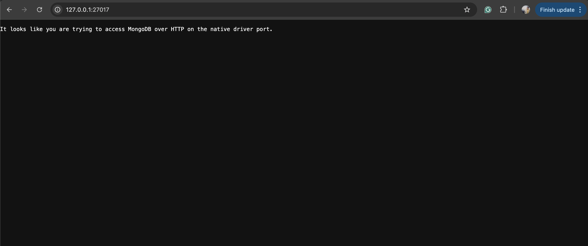
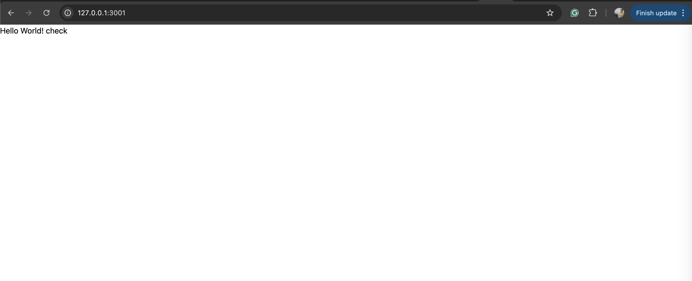
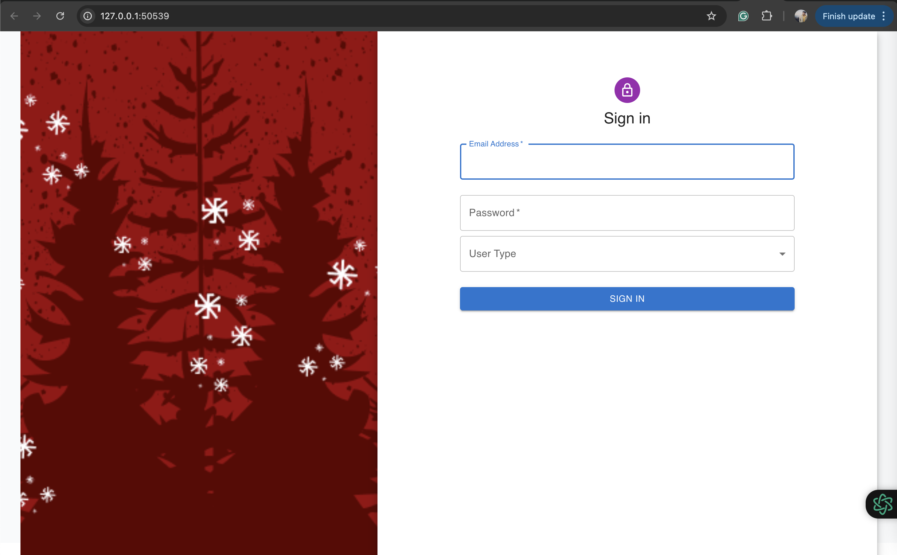
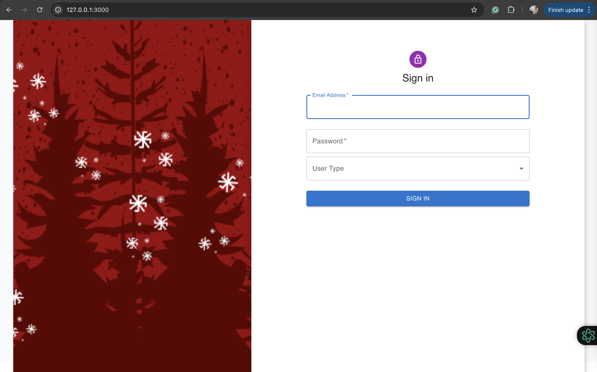
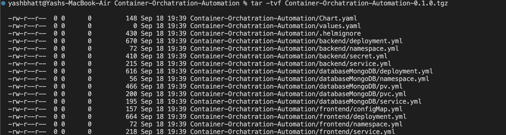
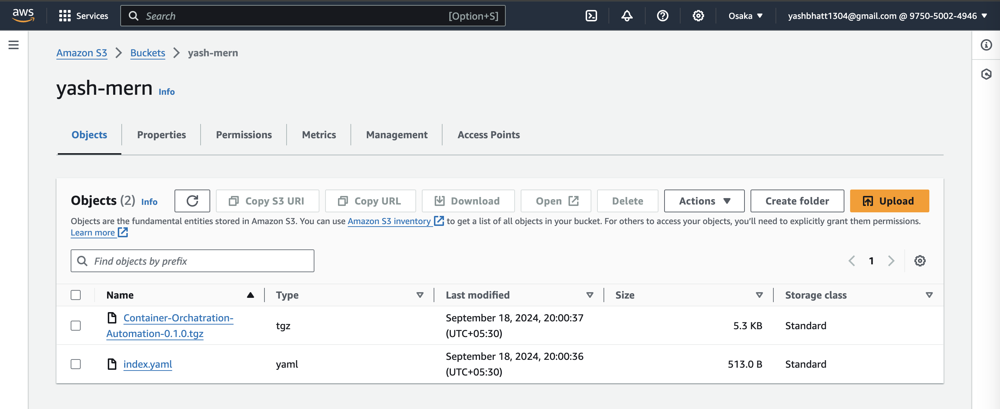
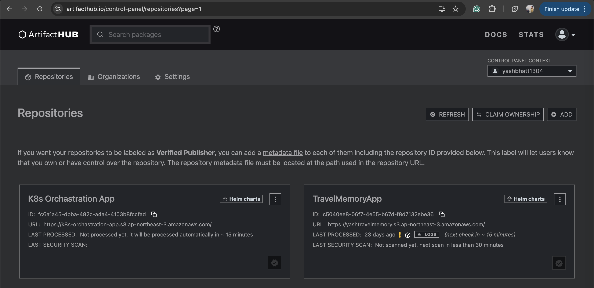

# Container-Orchatration-Automation


## Objective
1. Creating Kubernetes deployment files and a HELM chart for a MERN (MongoDB, Express.js, React.js, Node.js) based application.
2. Write Jenkins Groovy code to automate the build and deployment process, ensuring consistency and efficiency in your CI/CD pipeline.


## Concepts/Technology/Tool Covered
1. Kubenetes
2. Helm
3. Docker
4. Git & Github
5. Jenkins

## Steps

#### **_Setting up Database first_**

1. Apply the kubernetes files placed inside [Database](./databaseMongoDB/) in the folowing sequence as mentioned.
```
kubectl apply -f namespace.yml
kubectl apply -f pvc.yml
kubectl apply -f pv.yml
kubectl apply -f deployment.yml
kubectl apply -f service.yml
```
2. Check the pod is in running state with the command `kubectl get pods -n db-app` else wait until it's in running state.
> _note:- it might take few minutes._

3. You can check you mongo is up and running with the command `minikube service db-service -n db-app`. This will launch mongodb and minkube will take care for tunneling.
> _note:- Everytime the application is run with above step will create different port. For real world scenario we can use step 4 for this._

4. As the service is up and running inside the pod we need to access it through outside world, which can be done with the command `kubectl port-forward service/db-service 27017:27017 -n db-app`


5. You can check making connection to the DB at 27017 port.


#### **Setting up Backend**

1. Apply the kubernetes files placed inside [Backend](./backend/) in the folowing sequence as mentioned.
```
kubectl apply -f namespace.yml
kubectl apply -f secret.yml
kubectl apply -f deployment.yml
kubectl apply -f service.yml
```
2. Check the pod is in running state with the command `kubectl get pods -n learner-report-backend` else wait until it's in running state.
> _note:- it might take few minutes._

3. You can check you backend is up and running with the command `minikube service backend-service -n learner-report-backend`. This will launch backend and minkube will take care for tunneling.
> _note:- Everytime the application is run with above step will create different port. For real world scenario we can use step 4 for this._


4. As the service is up and running inside the pod we need to access it through outside world, which can be done with the command `kubectl port-forward service/backend-service 3001:3001 -n learner-report-backend`

5. You can check making connection to the backend at 3001 port.


#### **Setting up Frontend**

1. Apply the kubernetes files placed inside [Frontend](./frontend/) in the folowing sequence as mentioned.
```
kubectl apply -f namespace.yml
kubectl apply -f configMap.yml
kubectl apply -f deployment.yml
kubectl apply -f service.yml
```
2. Check the pod is in running state with the command `kubectl get pods -n learner-report-frontend` else wait until it's in running state.
> _note:- it might take few minutes._

3. You can check you mongo is up and running with the command `minikube service frontend-service -n learner-report-frontend`. This will launch mongodb and minkube will take care for tunneling.
> _note:- Everytime the application is run with above step will create different port. For real world scenario we can use step 4 for this._


4. As the service is up and running inside the pod we need to access it through outside world, which can be done with the command `kubectl port-forward service/frontend-service 3000:3000 -n learner-report-frontend`

6. You can check making connection to the frontend at 3000 port.


#### **Preparing helm Chart**
1. Create a helm package with the command `helm package .`.
2. Make sure unecessary file are added in **".helmignore"** file. You can check your helm package contains the right files with this command `tar -tvf Container-Orchatration-Automation-0.1.0.tgz`.

3. Now install the generated package with `helm install k8s-orchastration-app Container-Orchatration-Automation-0.1.0.tgz`.
4. Create a S3 Bucket, make sure it's public accessible and attach the below policy.
>{"Version":"2012-10-17","Statement":[{"Sid":"PublicReadGetObject","Effect":"Allow","Principal":"*","Action":"s3:GetObject","Resource":"arn:aws:s3:::k8s-orchastration-app/*"}]}
5. Generate **"index.yaml"** file using the S3 url with this command `helm repo index . --url https://k8s-orchastration-app.s3.ap-northeast-3.amazonaws.com/`.
6. Upload the **"index.yaml"** & **"Container-Orchatration-Automation-0.1.0.tgz"** files in S3.

7. Open [ArtifactHub Repositories](https://artifacthub.io/control-panel/repositories?page=1) and create new repository with name **"K8s Orchastration App"**.

8. Now add the repository with the command `helm repo add k8s-orchastration-app https://k8s-orchastration-app.s3.ap-northeast-3.amazonaws.com/`
9. You can see the repository is added in your system with the command `helm repo list`.


## References & Links


## Happy Coding
Thanks for continuing till the End. :)
